<!-- Profile README pour NicolasBOIVIN -->

  

  

## Salut, je suis Nicolas 👋

Cybersecurity Engineer / Sysadmin basé à Paris. Pentest, sécurité réseau, forensics, SIEM et automatisation IT.

- 🔐 Pentest & audit de sécurité
- 🌐 Réseau : Firewalls, VLANs, Proxies (Stormshield, Cisco, Huawei)
- 🕵️ Forensics & réponse à incident
- ⚙️ Automatisation PowerShell / Python / Bash
- 📜 En cours de certification CISM
# NicolasBoivin
